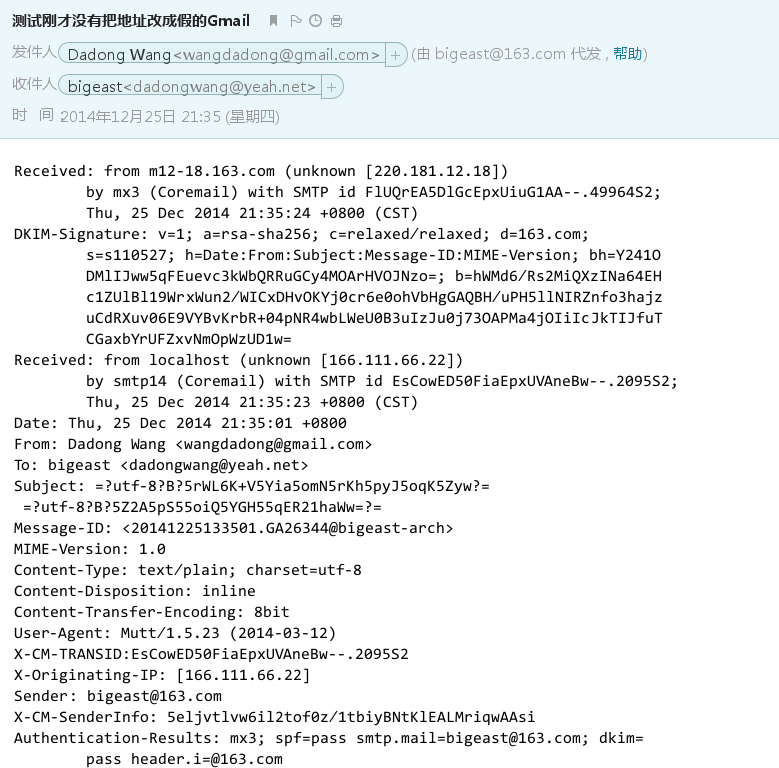

用假邮件地址发信
=====

通过配置msmtp和mutt，可以用假的邮件地址发信。

> ~/.msmtprc

	defaults
	logfile ~/.msmtp.log

	account 163
	tls off
	host smtp.163.com
	port 25
	from bigeast@163.com
	auth plain
	user bigeast@163.com
	password *yourpassword*

> ~/.muttrc

	set sendmail="/bin/msmtp"
	set from = "wangdadong@gmail.com"
	set realname="Dadong Wang"

用mutt发一封邮件到任意一个地址，然后查看结果如下：

所以发件人地址是不可信的，要看是不是由别的邮箱代发的。

我之前还以为，通过关联邮箱代发，是因为关联的时候得到了对方的通行证。现在看来好
像就算不关联，也是有可能以别的邮箱名义发送邮件的。

但如果看邮件详细的话还是能够看到，我这里是从localhost发送的：

